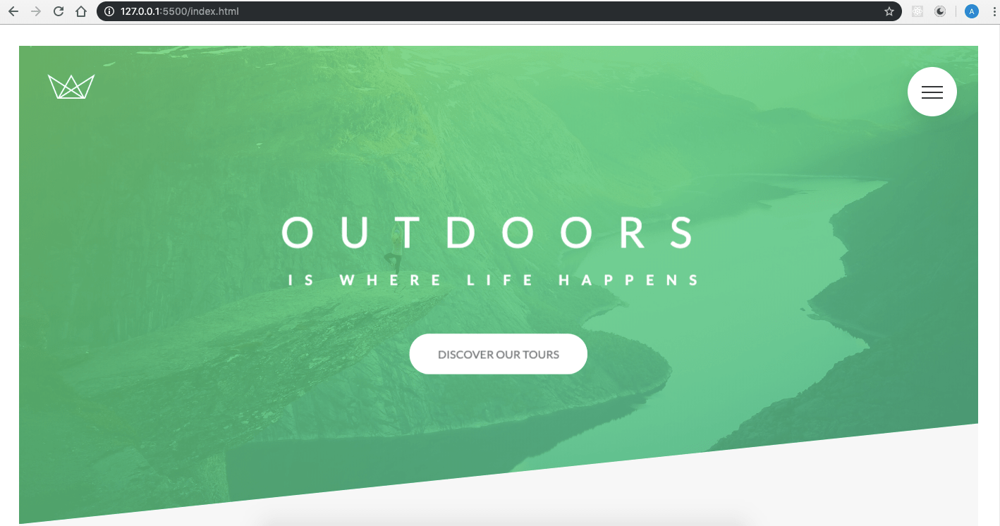
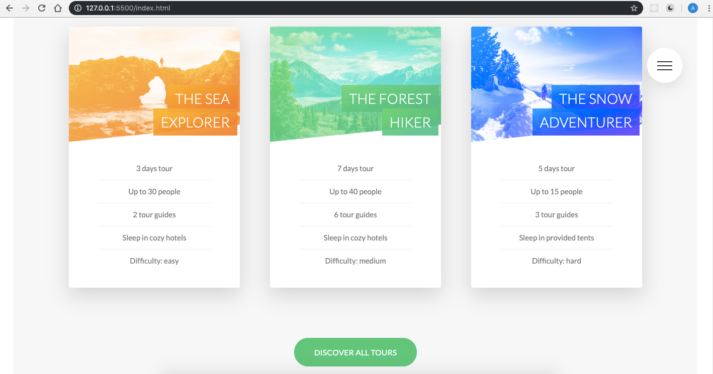

# Natours

This project is based on the course "Advanced CSS and Sass" by Jonas Schmedtmann. I took this course to learn advanced CSS techniques and I learned a lot through building this project.
If you want to check the course, go to this [link.](https://www.udemy.com/course/advanced-css-and-sass/)

### Project Description:

This project makes heavy use of cutting-edge CSS techniques to create stunning designs and effects. Also, it implements a solid CSS architecture that makes building upon the existing base easily scalable.

##### Hero Section



##### Animated Cards


##### Rotating Cards




### Features:

- CSS Architecture: 7-1 & BEM methodology
- Modern CSS techniques for design & effects
- Advanced CSS animations

### Tech stack & libraries:

- Sass
- node-sass library

### How to install this project

```sh
$ git clone https://github.com/andres-cruz/natours.git
$ cd natours
$ npm i
```

### How to run this project

This project uses the library node-sass to compile .scss files to .css:

```json
"devDependencies": {
    "node-sass": "^4.12.0"
  }
```

### Commands

To compile sass run this command:

```sh
$ npm run compile:sass
```

If you have installed live-server in your machine, you can run this command to launch the project:

```sh
$ live-server
```

### Scripts

This script in the package.json file is the responsible for compiling sass:

```json
"compile:sass": "node-sass sass/main.scss css/style.css"
```

You can add the "-w" flag to the script to make the compiler to watch for changes:

```json
"compile:sass": "node-sass sass/main.scss css/style.css -w"
```
